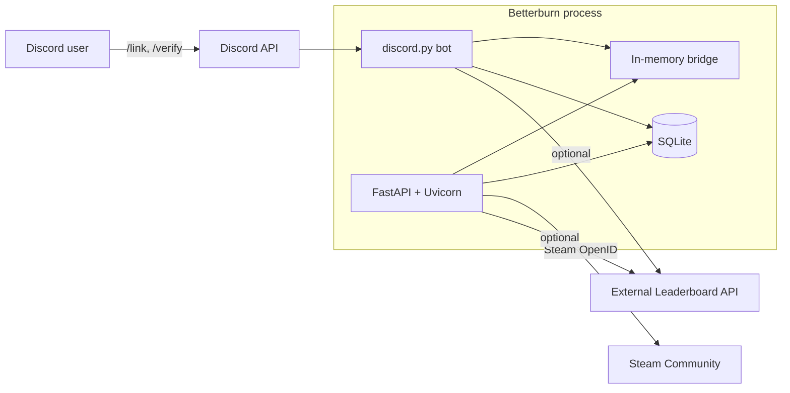
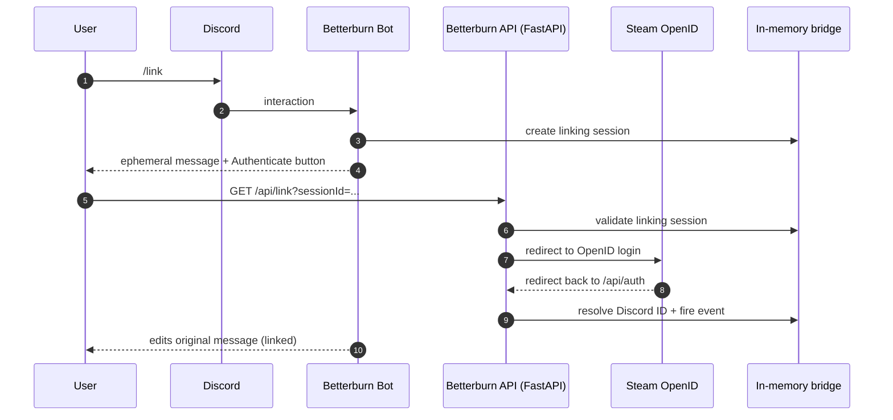

## Betterburn

Betterburn is a **Discord rank verification bot** for the Steam game app **`2217000`**.

It lets members **link their Discord account to Steam**, then **verifies their leaderboard standing (ELO + position)** and assigns a corresponding **Discord role** (Stone → Aetherean).

This repo runs two services in one Python process:

- a **discord.py bot** (slash commands + role management)
- a **FastAPI server** (Steam OpenID login callback + health endpoint)

They share state through a small in-memory bridge so the HTTP callback can complete the original Discord interaction.

---

## What it does

- **Account linking (Steam OpenID)**
	- `/link` sends a button that opens a Steam OpenID flow in the browser.
	- After Steam authentication, the callback links the SteamID to the user in the DB.
- **Rank verification → role assignment**
	- `/verify` computes a rank from (ELO, position) and assigns the mapped Discord role.
	- Optional rank cards/images are sent as part of verification.
- **Server configuration utilities**
	- Guild-scoped slash commands for configuration/diagnostics live in the bot cogs.
- **Health reporting**
	- `/healthz` returns a consolidated health status for monitoring.

---

## Architecture



### Dual-service process

Entry point: `src/main.py`

- **FastAPI** runs in a background thread (Uvicorn).
- **Discord bot** runs on the main event loop.

### Linking flow



1. User runs `/link`.
2. Bot creates a short-lived in-memory linking session and returns a link button.
3. FastAPI redirects the user to Steam OpenID.
4. Steam redirects back to `/api/auth`.
5. FastAPI validates the OpenID response, persists the link, and signals the bot through the IPC bridge.

### Leaderboard data sources

Betterburn supports two ways to obtain leaderboard standing:

- **External Leaderboard API** (recommended when available)
	- Enabled when `LEADERBOARD_API_BASE_URL` and `LEADERBOARD_API_KEY` are configured.
- **Local cached snapshot**
	- A background task refreshes a Steam leaderboard snapshot into SQLite.

Rank thresholds and mapping logic are intentionally centralized so role assignment stays consistent.

---

## Data storage

SQLite is used for:

- **Discord ↔ Steam links**
- **Guild ↔ role mappings**
- **Short-lived auth sessions**
- **(Optional) cached leaderboard snapshot**

By default the DB is `betterburn.db` (configurable via `DATABASE_URL`).

---

## Configuration

Configuration is read from environment variables (and `.env` when present). See `src/config.py`.

Common settings:

- `DISCORD_TOKEN` — Discord bot token
- `APPLICATION_PORT` — FastAPI/Uvicorn port (defaults to `80`)
- `API_URL` — public host name users can reach (used to build external callback URL)
- `DATABASE_URL` — SQLAlchemy URL (default `sqlite:///betterburn.db`)
- `TEST_GUILD` — comma-separated guild IDs to register slash commands into (recommended for development)

Optional Leaderboard API integration:

- `LEADERBOARD_API_BASE_URL`
- `LEADERBOARD_API_KEY`

Steam identifiers (defaults match the target game):

- `APP_ID` (default `2217000`)
- `LEADERBOARD_ID`

Security note: don’t commit real tokens/keys to git. Prefer `.env` or your deployment secret store.

---

## Running locally

### 1) Set up Python

Python 3.12 is the intended runtime (see `Dockerfile`). Dependencies are declared in `pyproject.toml`.

### 2) Provide environment

Create a `.env` file (or export vars) with at least:

- `DISCORD_TOKEN=...`
- `API_URL=your.public.host.name` (or `localhost` for local-only testing)

### 3) Start

Run the module entrypoint:

```bash
python -m src.main
```

This starts:

- FastAPI on `http://0.0.0.0:${APPLICATION_PORT}`
- the Discord bot (slash commands will sync to `TEST_GUILD`)

---

## Running with Docker

This repo includes a `Dockerfile` and `docker-compose.yml`.

- The compose setup mounts persistent storage for:
	- SQLite DB (`/data`)
	- logs (`/app/logs`)
- It loads environment variables from `.env`.

Typical workflow:

```bash
docker compose up --build
```

---

## Slash commands (user-facing)

The exact set of commands may evolve, but these are the core flows:

- `/link` — start Steam OpenID linking
- `/unlink` — remove link
- `/verify` — compute rank and assign the configured role

---

## Development

- Lint/format: `ruff`
- Tests: `pytest` (+ `pytest-asyncio`)

```bash
pytest
```

---

## Repository layout

- `src/main.py` — starts both services
- `src/bot/` — discord.py bot, cogs, and views
- `src/api/` — FastAPI app + endpoints
- `src/db/` — SQLAlchemy models and DB utilities
- `src/bridge.py` — in-memory bridge between the web callback and the Discord interaction
- `tests/` — unit tests

---

## License

Licensed under the **GNU Affero General Public License v3.0 (AGPL-3.0)**.

See `LICENSE` for details.

